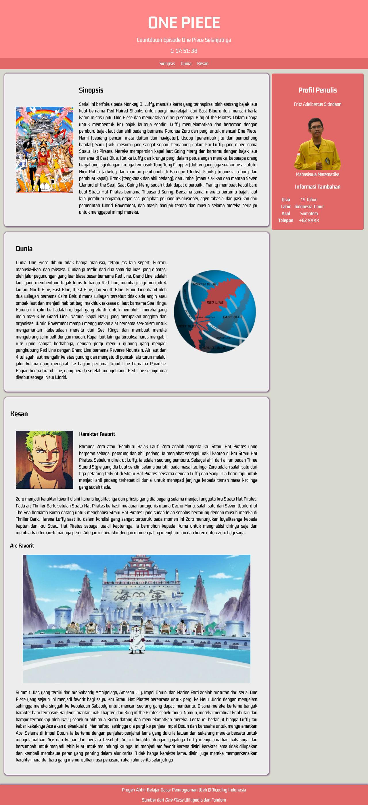

# Dicoding Academy - Final Project for 'Belajar Dasar Pemrograman Web'

This is a submission to the 'Belajar Dasar Pemrograman Web' Final Project. Dicoding Academy Final Project is a a requirement to graduate the class. 

## Table of contents

- [Overview](#overview)
  - [Screenshot](#screenshot)
  - [Links](#links)
- [My process](#my-process)
  - [Built with](#built-with)
  - [What I learned](#what-i-learned)
- [Author](#author)
- [Acknowledgments](#acknowledgments)

## Overview

### Screenshot



### Links

- Submission URL: [Github Repo](https://github.com/fritzadelbertus/DAP_Info_Page)
- Live Site URL: [Github Pages](https://fritzadelbertus.github.io/DAP_Info_Page/)

## My process

### Built with

- Semantic HTML5 markup
- CSS custom properties
- Flexbox
- Mobile Responsive
- Vanilla JavaScript

### What I learned

Really refresh my web designing skill and also enhance the priciples

I want to mention this algorithm that I used to calculate the next Sunday for every week

```js
const hariIni = new Date();
const zeroDate = new Date(0);
let selisihHari = (((hariIni-zeroDate)/(1000*60*60*24))%7);
if (selisihHari > 3) {
    selisihHari -= 3;
} else {
    selisihHari +=4;
};
let timer = Math.floor((7 - selisihHari)*24*60*60);
```

## Author

- Website - [Fritz Adelbertus Sitindaon](https://www.furitsu.site)
- LinkedIn - [Fritz Adelbertus](https://www.linkedin.com/in/fritzadelbertus/)

## Acknowledgments

Thank you for Dicoding Academy for providing this project. It really refresh my CSS and HTML Skills.
